# Econte Lab

Econte Lab is a blog site that hopes to create a platform where like-minded individuals can keep motivated to live mindfully by sharing tips and strategies on how to become a mindful pereson.

It is available to the whole world aiming to enrich other people’s lives by providing content that can help hone a positive outlook toward life.

Users will be able to sign up and login to their account to leave comments and interact.

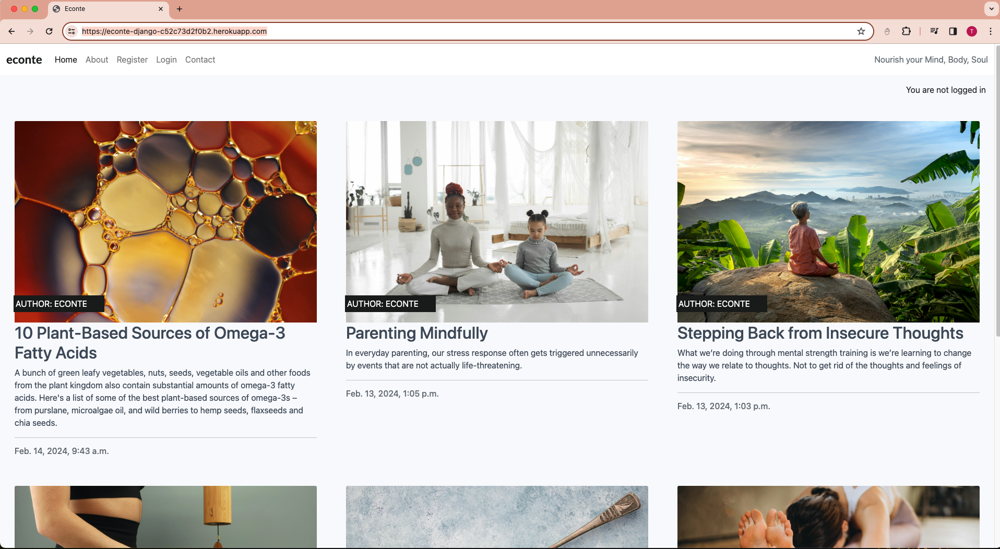

## Database

There are three Django models: About, Blog, Contact.
Below diagram shows relationships between them:

 [Diagram](static/images/econte_index.png)

- __Home Page__›

  - Wireframe image below shows top and bottom mobile view of the Home page.

- __Blog Page__

  - Wireframe image below shows top and bottom mobile view of the Blog page.

- __Subscibe Page__

  - Wireframe image below shows mobile view of the Subscribe page.

## Features 

### Existing Features

- __Navigation Bar__

  - Featured at the top of the page, the navigation shows the blog name in the left corner: Econte.
  - Featured on all five pages on the left, the full responsive navigation bar includes links to the Home, About, Register, Login and Contact page and is identical in each page to allow for easy navigation.
  - This section will allow the user to easily navigate from page to page across all devices without having to revert back to the previous page via the ‘back’ button.
  - The navigation clearly tells the user the name website and makes the different sections of information easy to read.

 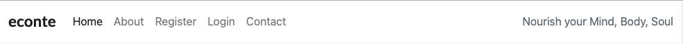

- __The Blog Landing Page__

  - The landing includes the blog page will provide the users with thoughtful contents to uplevel their life, focusing on mindfulness and personal growth.

 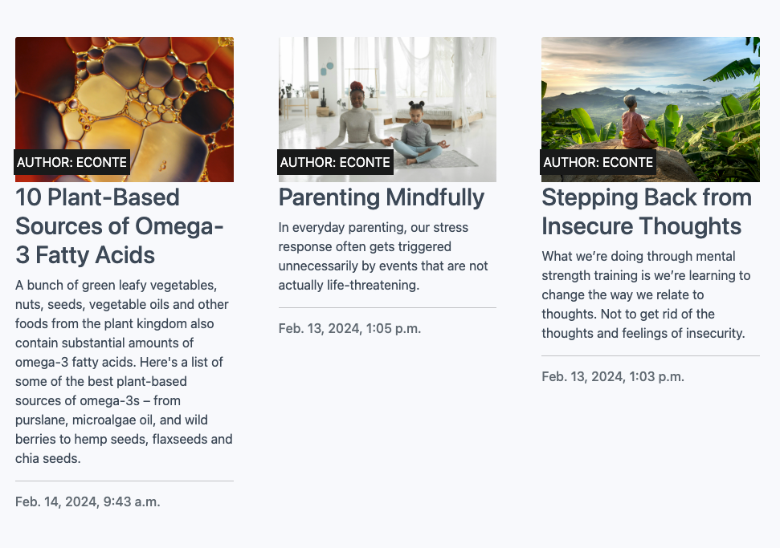

 - __The Footer__ 

  - The footer section includes links to the relevant social media sites (Facebook, Youtube, X, Instagram) for Econte. The links will open to a new tab to allow easy navigation for the user. 
  - The footer is valuable to the user as it encourages them to keep connected via social media.

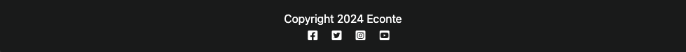

- __Blog Post Page__

  - This section is valuable to the user as the contents will be able to provide valuble insight and tips on living mindfully.

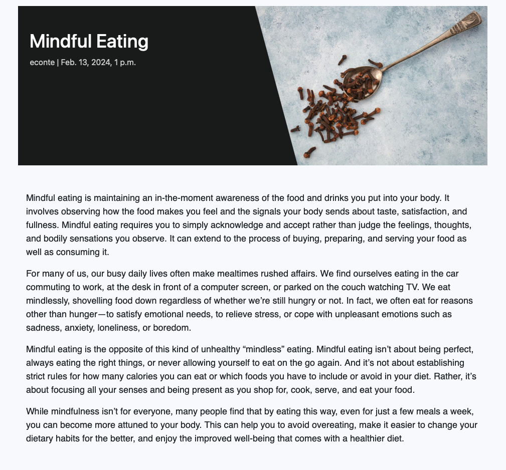

- __Comment Section__

  - Comment section will allow signed in users to leave and edit comments.

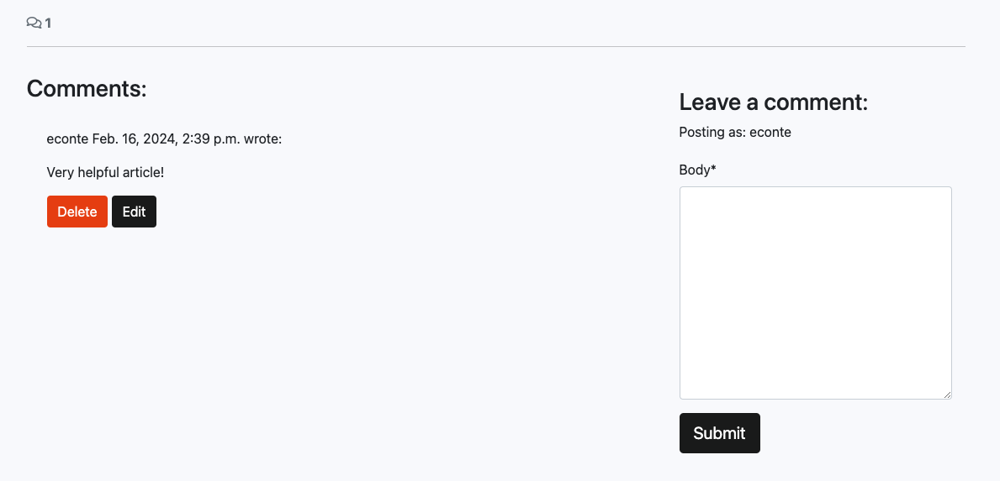

- __About Page__

  - About section will allow the users to understand what is mindfulness and see the benefits of joining the community of mindfulness. 
  - Users will see the value of signing up for the Econte blog subscription.

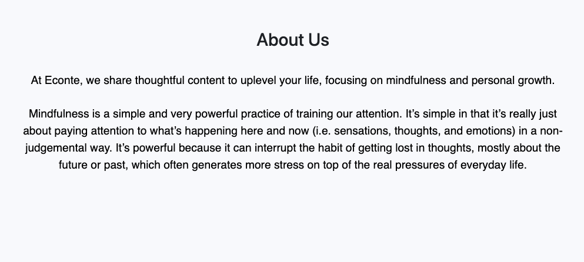

- __Sign Up Page__

  - Sign up page will allow the users to sign up for a login id.

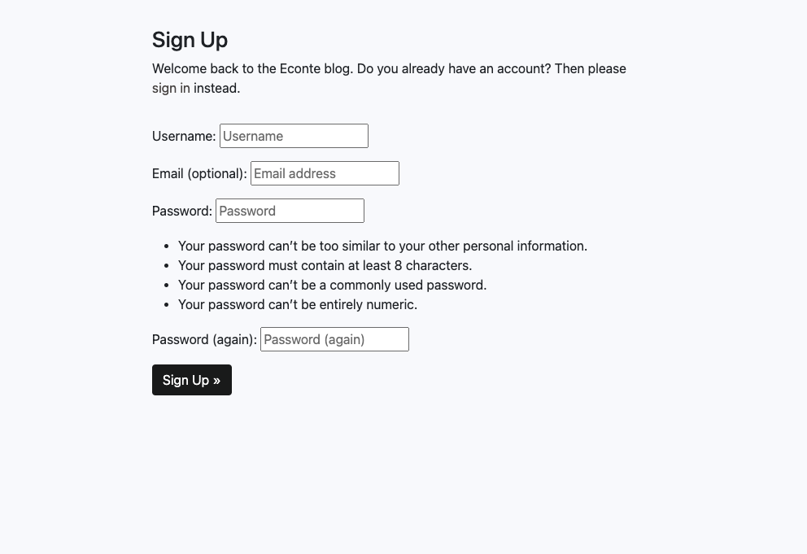

- __Sign In Page__

  - Sign in page will allow the users to sign in to leave and edit comments/ blog posts.

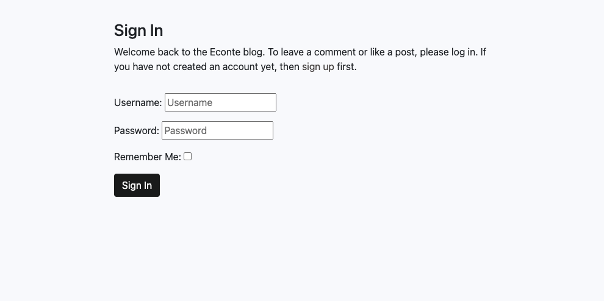

- __Sign Out Page__

  - Once you are signed in, sign out page will allow the users to sign out.

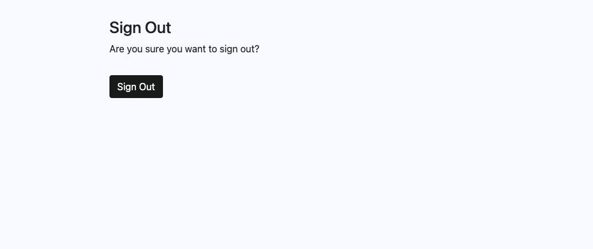

- __Contact Page__

  - This page will allow the user to contact us. The user will be asked to submit their name, email address and mesaage.

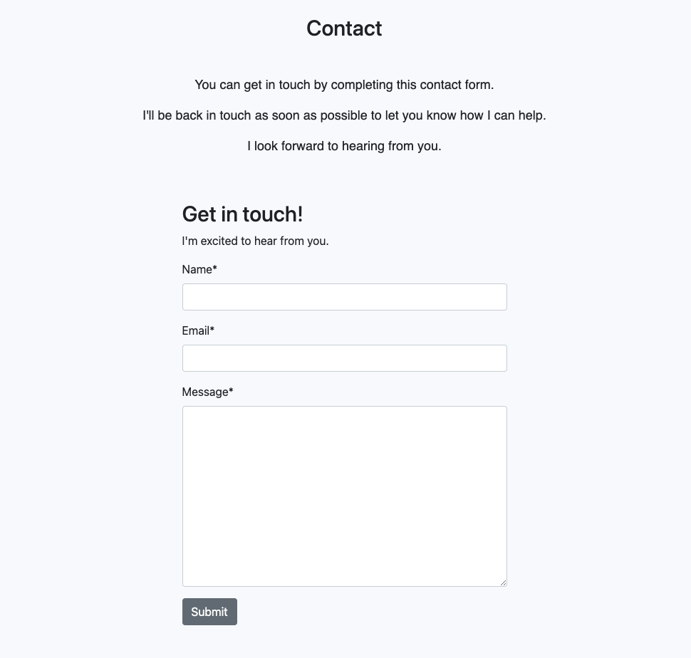

### Features Left to Implement

- In the future, I would like to implement a feature where users can view and signup for mindfulness classes (provided by third party) arounds the world.
- Mindfulness classes such as meditation, soundbath and yoga etc. are the some of examples.

## Testing

 - Econte page works in differnet browsers: Chrome, Firefox, Safari 

 - This website is responsive, looks good and functions on all standard screen sizes using the devtool device toolbar.

 - Navigation menu will change to hamburger icon if viewed in smaller devices.

 - The home, about, sign up, sign in, sign out, and contact text are all readable and easy to understand.

 - Form in the contact page works: requires entries in every field, will only accept an email in the email field,  and the submit button works.

 - Comment form validation passed the automated test.

 - Contact form validation passed the automated test.

### Validator Testing 

- HTML
  - No errors were returned when passing through the official [W3C validator](https://validator.w3.org/)
   - Blog page:
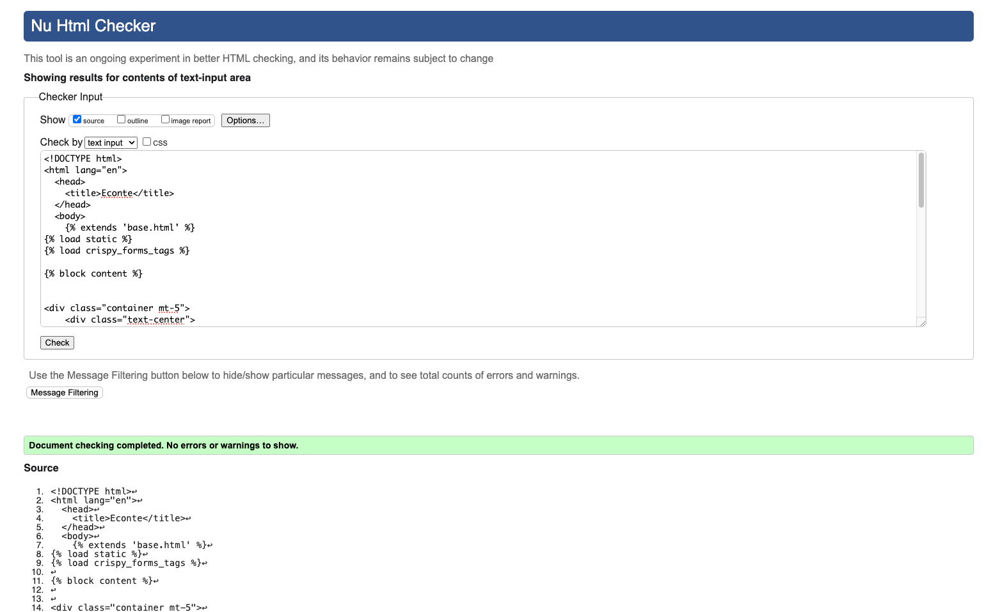
   - About page:
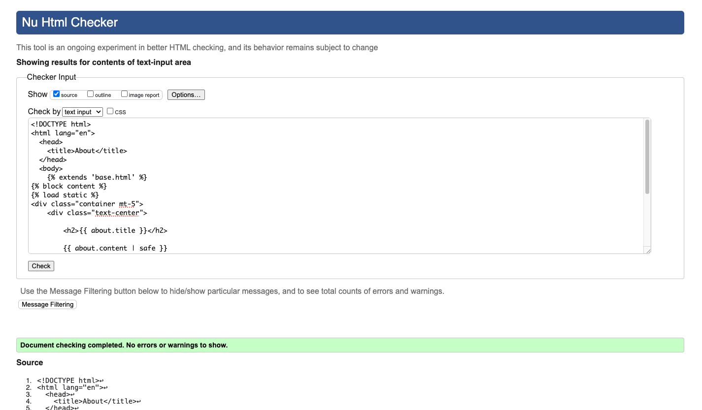
   - Contact page:
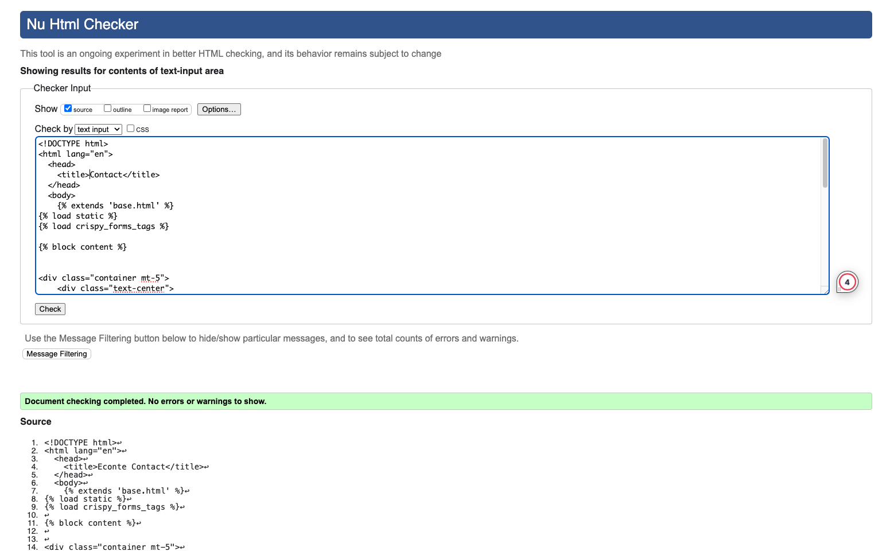
- CSS
  - No errors were found when passing through the official [(Jigsaw) validator](https://jigsaw.w3.org/css-validator/)
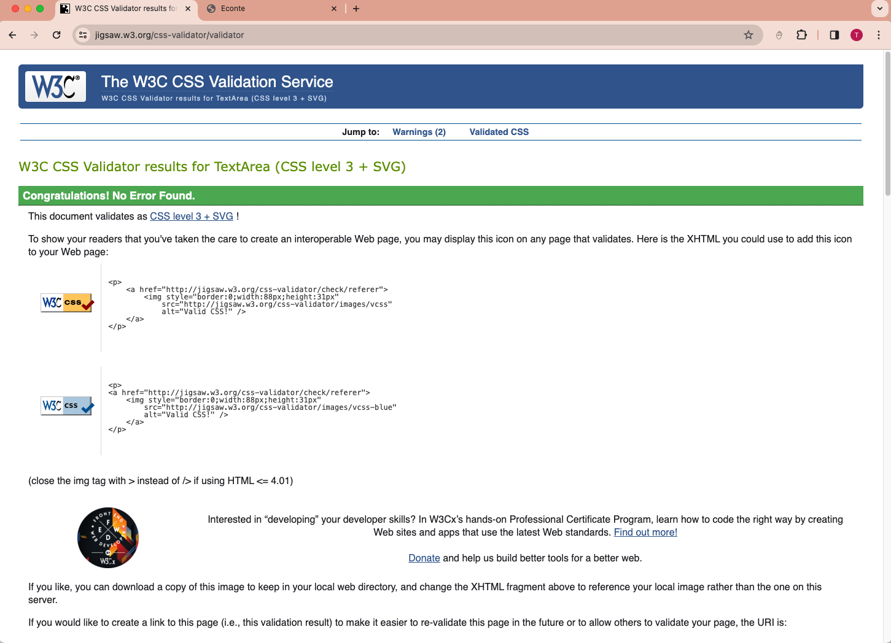
- Accessibility
  - Colors and fonts chosed are easy to read and accessible by running it through lighthouse in devtools.
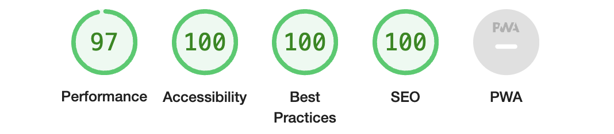

 ### Unfixed Bugs

No unfixed bugs

## Deployment

- The site was deployed using Heroku.

The live link can be found here - https://econte-django-c52c73d2f0b2.herokuapp.com/

## Credits

### Content 

- The text for the Home page and blog articles was taken from [Mellio Obrien](https://melliobrien.com/)

- The code to make the social media links was take from the [CI I Think Therefore I Blog](https://learn.codeinstitute.net/courses/course-v1:CodeInstitute+FSD101_WTS+2023_Q3/courseware/56a2da0940b4411d8a38c2b093a22c60/4565659a34d648b8b8edd063c3182180/)
- The code to make the navigation was take from the [CI I Think Therefore I Blog](https://learn.codeinstitute.net/courses/course-v1:CodeInstitute+FSD101_WTS+2023_Q3/courseware/56a2da0940b4411d8a38c2b093a22c60/4565659a34d648b8b8edd063c3182180/)
- The code to make contact page was take from the [CI I Think Therefore I Blog](https://learn.codeinstitute.net/courses/course-v1:CodeInstitute+FSD101_WTS+2023_Q3/courseware/56a2da0940b4411d8a38c2b093a22c60/4565659a34d648b8b8edd063c3182180/)
 The code to make blog page was take from the [CI I Think Therefore I Blog](https://learn.codeinstitute.net/courses/course-v1:CodeInstitute+FSD101_WTS+2023_Q3/courseware/56a2da0940b4411d8a38c2b093a22c60/4565659a34d648b8b8edd063c3182180/)
- The icons in the footer were taken from [Font Awesome](https://fontawesome.com/)

### Media

- The photos used on the home, blog and subscibe pages are from [Pexels](https://www.pexels.com/)
